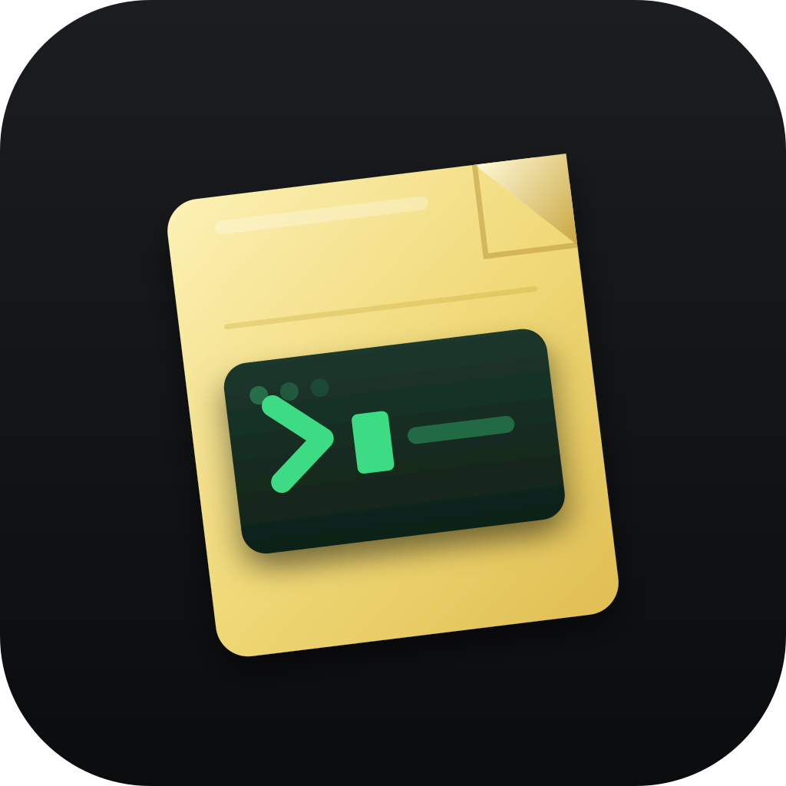

# ScratchCLI

**CLI-first coding scratchpad for Windows.** A local-first notepad and shell in one window — notes, files, Python run/build, and optional AI — without forcing a cloud account.

ScratchCLI boots into a full console (CMD / PowerShell / WSL / Python). Open a note or file to enter **Editor mode** (nano-style) with a transparent CLI strip. `close` / Esc returns home; `resume` brings your tabs back.



## Why ScratchCLI

- **CLI is home** — not a buried terminal panel
- **Local-first** — notes and API keys stay on your PC (`%APPDATA%`)
- **Fast scratch loop** — new note → edit → `run` / `build` → back to CLI
- **Optional AI** — Assistant, DSA coach, or host `claude` / `codex` in-app when you want them
- **No account required** — each Windows user starts fresh

## Features

| Area | What you get |
|------|----------------|
| **Notes** | Pin, color, archive, trash, revision history (`Ctrl+Shift+N` / Menu → Library) |
| **Editor** | Tabs, up to 4 split panes, Markdown / Python / plain text |
| **Shell** | In-app CMD, PowerShell, WSL; interactive TUIs via PTY |
| **Python** | `run` / `build` on the current buffer using system Python |
| **Assistant** | Local Ollama / LM Studio first; optional OpenAI / Anthropic / xAI keys |
| **DSA coach** | Practice / hints / visualize (`coach` or `Ctrl+G`) |
| **Agents** | `claude` / `codex` if installed on PATH |
| **Appearance** | Themes, fonts, opacity (`Ctrl+,`) |

API keys: **Menu → AI keys** or type `env`. See [PRIVACY.md](PRIVACY.md).

## Install (Windows)

### From a release installer

1. Download `ScratchCLI_0.1.0_x64-setup.exe` from [Releases](../../releases).
2. Run the installer (SmartScreen may warn if the build is unsigned).
3. Launch **ScratchCLI**. Requires **WebView2** (included on most Windows 10/11 PCs).

Silent install (e.g. Store / scripts):

```text
ScratchCLI_0.1.0_x64-setup.exe /S
```

### Build from source

**Prerequisites:** Node.js 20+, Rust (MSVC), WebView2. For Python features, Python 3 on PATH.

```powershell
winget install --id Rustlang.Rustup
rustup default stable-msvc
# reopen the terminal, then:
git clone <your-repo-url> ScratchCLI
cd ScratchCLI
npm.cmd install
npm.cmd run tauri dev
```

Release installer:

```powershell
$env:Path = "$env:USERPROFILE\.cargo\bin;" + $env:Path
npm.cmd run tauri build
```

Outputs:

- `src-tauri/target/release/bundle/nsis/ScratchCLI_0.1.0_x64-setup.exe`
- `src-tauri/target/release/scratchcli.exe`

## Quick start

```text
help                 Show commands
new My note          Create a note and open the editor
open path\to\file.py Open a disk file
close / Esc          Back to CLI (keeps tabs for resume)
resume               Return to Editor with open tabs
run / build          Run or syntax-check Python buffer
assistant            Open Assistant (Ctrl+Shift+A)
coach                Open DSA coach (Ctrl+G)
env                  AI keys & local model URLs
theme pro            Switch theme
```

Command palette: **Ctrl+K**. Focus CLI: **Ctrl+`** or **Ctrl+\\**.

## Data & privacy

| Data | Location |
|------|----------|
| Notes DB | `%APPDATA%\com.scratchcli.desktop\scratchcli.db` |
| API keys | `%APPDATA%\com.scratchcli.desktop\secrets.json` |
| AI / appearance prefs | WebView localStorage |

Per Windows user. Not baked into the EXE. Details: [PRIVACY.md](PRIVACY.md).

## Development

```powershell
npm.cmd run tauri dev          # full app
npm.cmd run validate:frontend  # format, types, tests, lint, vite build
```

Native checks (from `src-tauri`):

```powershell
cargo fmt --check
cargo clippy --all-targets --all-features -- -D warnings
cargo test
```

Stack: Tauri 2, React, TypeScript, CodeMirror 6, Zustand, Rust, SQLite.

## License

See repository license file (or add one before publishing).

---

**v0.1.0** — first public Windows build.
